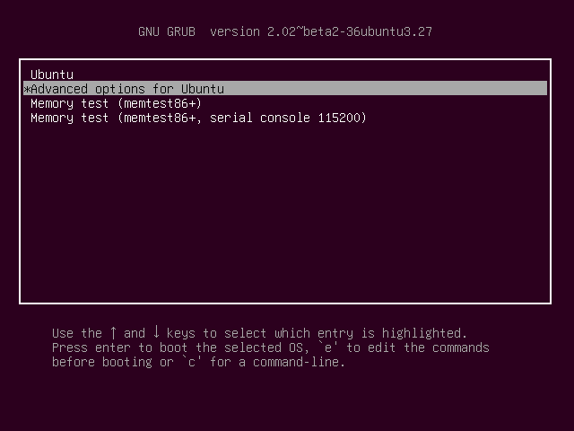
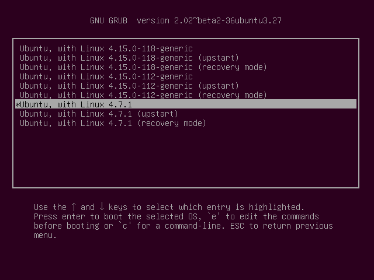

# OS2021: Challenge #1: Linux Kernel

## 1. Working with System Calls in C

### Question 1
#### What is more expensive a *System call* or a *Procedure call* concerning **time**?
The hypothesis is that the *System call* will be more expensive because they need to change the context to access the kernel.

### Question 2
#### How much more expensive is a *System call* or a *Procedure call* respect the other?
The difference usually is between 0.3 and 0.5 microseconds.

### Question 3
#### Design an experiment to test and proof which call is more time expensive. Write a simple test program in C to compare the cost of a simple procedure call to a simple system call (i.e getpid()).
To do this we created two functions, *system\_call()* and *procedure\_call()*.
The first one just it's just a *getpid()*, and the second one just calls *dummy_function()* which just returns the integer 3.
All the code is in *working_with_system_calls_in_c.c*
 

---

## 2. Compiling and running the kernel

### Question 4
#### Explain the process to enter and check into the new kernel version.
Once the new kernel has been compiled we need to update Grub configuration.
To do this we used `sudo vim /etc/default/grub` and commented the `GRUB_HIDDEN_TIMEOUT` line and set the `GRUB_TIMEOUT` to -1, this way the boot manager will wait until we pick which kernel do we want to boot in.


Now, when we boot we get this Grub menu, and if we go to 'Advanced options for Ubuntu'



We can see both kernels, the original (4.15.0) and the local-compiled (4.7.1)



### Question 5
#### Research the roles of files in /boot/?
* vmlinuz-* \
This file it's the compressed Linux kernel, and it's (tècnicament, perque no és executable, cosa que no acabo d'entendre) bootable.

* initrd.img \
This file is a scheme for loading a temporary root file system into memory, which is used on the boot.

* grub \
This folder contains all the files needed for the GUI Grub menu.

* config* \
This file contains the kernel configuration.

---

## 3. Analysing kernel and system calls

### Question 6
#### Explain what this code is supposed to do.
```bash
SYSCALL_DEFINE1(my_syscall , char *, msg)
{
    printk(KERN_INFO "my_syscall:\"%s\"\n", msg);
    return 0;
}
```
This code creates a system call that could be implemented in a program written in *C* and it's supposed to print the message you write on the memory direction you pass through *msg*, through the kernel.

### Question 7
#### Check or think if the execution of this code could be dangerous? If answer is yes, correct it.
The code it's dangerous because you can write some instructions to hack the computer on a memory direction and pass it through the *msg* variable.

---

## 5. Creating *GetInfoProc* System Call

#### We are going to create a system call that allows us to obtain information about a specific process such as the elapsed_time, start_time, sys_time and user_time. But feel free to return and store other information if you want.

You can see our propouse (proposta) in *5_creating_getinfoproc_system_call.diff* file.
The only problem we hem tingut was that we can't use the sys/time.h library on kernel/sys.c and we can't use the *gettimeofday()* function to get the *elapsed_time*.

---

## 6. Hacking a system call

#### Hack your kernel to print “:) Your file ``filename.txt`` is being opened!!!” when the user opens a file.

To do this first we followed the pista and went into *fs/open.c*. When we realized this file was el encarregat de la funció *open()* we searched for the correct function, it was at line 1001, *do_sys_open()*.
So we added a *printk(":) Your file %s is being opened!!!", tmp->name);* using the tmp structure of filename type (joquese cristian no se com explicar-me millor, no entenc les estructures ni en catalá) (perdó si sono agresiu, i'm just tired :'( ) 
The only problem is that the field "name" contains the full path, but we have been incapaços de get only the file name, srry per ser uns incompetents de merda, jo també m'esperava més de mi mateix Jordi, 0 worries.
Our proposta again is in the *6_hacking_a_system_call.diff* file.
