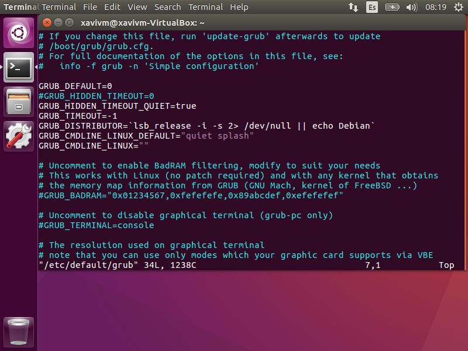

# OS2021: Challenge #1: Linux Kernel

## 1. Working with System Calls in C

### Question 1
#### What is more expensive a *System call* or a *Procedure call* concerning **time**?
The hypothesis is that the *System call* will be more expensive because it will need to change the context to access the kernel.

### Question 2
#### How much more expensive is a *System call* or a *Procedure call* respect the other?
The difference usually sits between 0.3 and 0.5 microseconds.

### Question 3
#### Design an experiment to test and proof which call is more time expensive. Write a simple test program in C to compare the cost of a simple procedure call to a simple system call (i.e getpid()).
To do this we created two functions, `system\_call()` and `procedure\_call()`.
The first one it's just a `getpid()`, and the second one just calls `dummy_function()` which just returns the integer 3.
Then we repeated each function a million times and used the `timeval` structure and the `gettimeofday()` function to get the execution time of both calls.\
All the code is in *working_with_system_calls_in_c.c*
 

---

## 2. Compiling and running the kernel

### Question 4
#### Explain the process to enter and check into the new kernel version.
Once the new kernel has been compiled we need to update Grub configuration.
To do this we used `sudo vim /etc/default/grub` and commented the `GRUB_HIDDEN_TIMEOUT` line and set the `GRUB_TIMEOUT` to -1, this way the boot manager will wait until we pick which kernel do we want to boot in.



Now, when we boot we get this screen, the Grub boot manager, and if we select 'Advanced options for Ubuntu'


We can see both kernels, the original (4.15.0) and our custom one (4.7.1)


### Question 5
#### Research the roles of files in /boot/?
* vmlinuz-* \
This file is the compressed Linux kernel, and it's bootable.

* initrd.img \
This file is a scheme for loading a temporary root file system into memory, which is used while booting the OS.

* grub \
This folder contains all the files needed for the GUI Grub menu.

* config* \
This file contains the kernel configuration.

---

## 3. Analysing kernel and system calls

### Question 6
#### Explain what this code is supposed to do.
```bash
SYSCALL_DEFINE1(my_syscall , char *, msg)
{
    printk(KERN_INFO "my_syscall:\"%s\"\n", msg);
    return 0;
}
```
This code creates a system call that could be implemented in a program written in *C* and it's supposed to print the message you write on the memory direction you pass through *msg*, through the kernel.

### Question 7
#### Check or think if the execution of this code could be dangerous? If answer is yes, correct it.
The code is dangerous because you can write some instructions to hack the computer on a memory direction and pass it through the *msg* variable.

---

## 5. Creating *GetInfoProc* System Call

#### We are going to create a system call that allows us to obtain information about a specific process such as the elapsed_time, start_time, sys_time and user_time. But feel free to return and store other information if you want.

You can see our exercice in *5_creating_getinfoproc_system_call.diff* file.\
The only problem we had was that we couldn't use the sys/time.h library on kernel/sys.c and we neither could use the `gettimeofday()` function to get the `elapsed_time`.

---

## 6. Hacking a system call

#### Hack your kernel to print “:) Your file ``filename.txt`` is being opened!!!” when the user opens a file.

To do this first we followed the clue and went into *fs/open.c*. When we realized this file was the one in charge of the `open()` function we searched for the correct function, it was at the 1029 line, `SYSCALL_DEFINE3(open, const char __user *, filename, int, flags, umode_t, mode)`.
So we added `printk(":) Your file %s is being opened!!!", filename);` using the `filename` string.
The only problem is that the field "name" contains the full path, but we have been unable de get only the file name. \
Our work is in the *6_hacking_a_system_call.diff* file.
